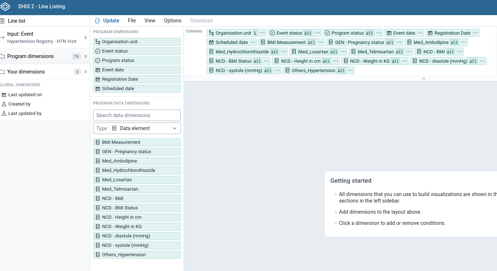
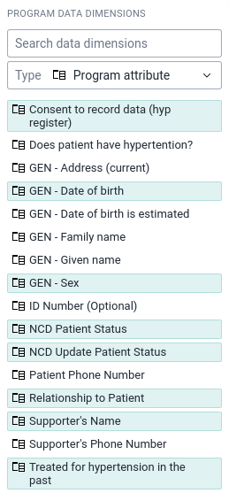
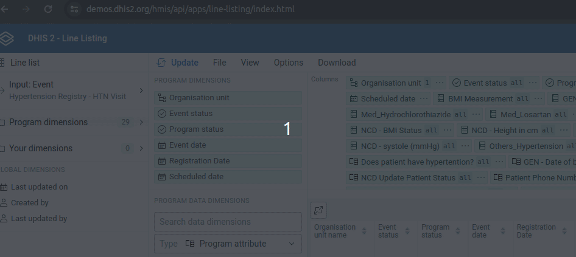
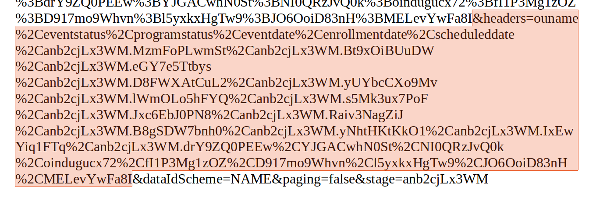

# DHIS2 Line Listing: data sharing protocol

This repo holds a data extraction protocol along with a cleaning script `LL_indexer.py` to prepare a data export through a DHIS2 Line Listing app from Tracker program, specifically a Hypertension Registry.

1) Open the Line Listing app and go to the Program (Hypertension Registry). Choose **Input: Event** as we want a long dataset.

2) Select all  *Program Dimensions*  (Orgunit down to Scheduled Date). Under *Program Data Dimensions* select Type Data Element and select ALL data elements in the stage (this is a single event program).

3) From the Type Menu select Program Attribute, then choose the following Attributes:  _Consent to record data, Date of birth, Sex, Patient Status, Update patient status, Phone number, Supporter's Name, Relationship to Patient, Treated for hypertension in the past_ (phone numbers, dob, and supporters name will be removed later by script, see below)

4) Click **Update**
5) This is the data we need, but it does NOT include the Enrollment ID by default. Go to **Download > as CSS+HTML**. Copy the URL that opens.
6) Paste the URL into a word document / text editor/

7) We now need to remove the headers from the analytics query. Select  
**&headers=**    .... 
until the next **&** and delete the highlight.

8) Find the extension *.html+css* with and replace with *.csv*

9) Paste back into the Line List browser and download the dataset! The final step is to CLEAN and anonymize the data with the *LL_indexer.py* script.

10) Add the downloaded file to the LL_indexer folder. Rename it input_file.csv 
11) Open the terminal within the folder and enter

>  `python3 LL_indexer.py`

This will perform the following functions:
* Calculate Age at Time of Enrollment from the enrollment date and DOB.
* Give the enrollment IDs a new, internal index ID.
* Transform phone number and supporters name into dummy variables (1 if present, 0 if absent).
* Delete TEI and enrollment IDs.

The script requires pandas. You may need to import pandas using pip3 install pandas 